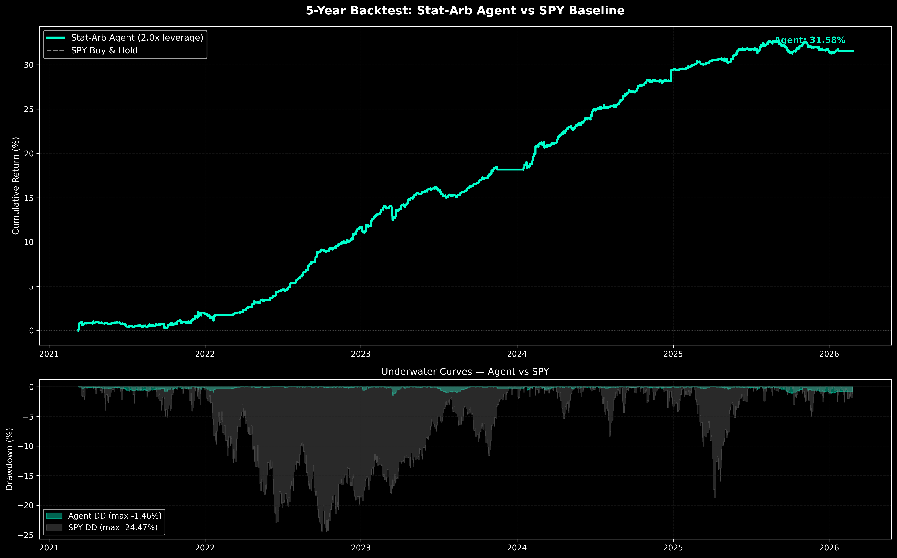

# Autonomous Algorithmic Trading Agent

A fully autonomous statistical arbitrage system trading in Alpaca's paper environment. Currently deployed on AWS EC2 with $100K starting capital for a 90-day live forward test.

## Current Status

🟢 **Paper Trading Active** — The agent is live on Alpaca's paper account, executing trades autonomously during U.S. market hours. This is the forward-validation phase; performance is being evaluated on truly out-of-sample data. Results will be published at the end of the 90-day trial.

## How It Works

The system runs 24/7 across two nodes: a **Research Node** (MacBook Pro) that rediscovers opportunities after hours, and an **Execution Node** (Dockerized on AWS EC2) that trades them intraday via Alpaca's WebSocket.

**Signal Generation** — DBSCAN clusters correlated assets from a 110-ticker universe, then Johansen cointegration isolates mean-reverting spreads with statistically significant half-lives.

**Trade Filtering** — An XGBoost meta-labeler scores every candidate signal using fractionally differentiated features and microstructure dynamics. Only setups exceeding a dynamic probability threshold reach the order router.

**Risk Control** — Hierarchical Risk Parity (HRP) allocates capital across active spreads daily. A CUSUM filter on SPY monitors for regime breaks and blocks new entries during macro instability. Cooldown timers, EOD liquidation, and short-borrow checks prevent whipsaw and overnight gap risk.

## Backtest Results

In-sample backtest over 5 years (March 2021 – February 2026) using walk-forward lifecycle-aware cointegration discovery, share-based P&L accounting, realistic slippage and borrow costs, and Reg-T leverage (2.0x):

| Metric | Agent | SPY |
|---|---|---|
| Total Return | 31.58% | ~60% |
| Max Drawdown | **-1.46%** | -24.47% |
| RoMD | **21.64** | ~2.4 |

Parameters (`Z=2.39, AI=0.56, PT=1.90, SL=1.75, Lev=2.0x`) were selected via survival-constrained Monte Carlo optimization that rejects configurations with drawdown exceeding 20% of starting equity.

**Caveats:** This is an in-sample result — baskets were discovered on the same price history being tested. Real paper trading will likely show lower returns and higher drawdowns. The point of the 90-day trial is to measure the out-of-sample gap.

## Data

Training data sourced from **Wharton Research Data Services (WRDS)** — TAQ millisecond-resolution trades across all U.S. exchanges, January 2021 through February 2026.

## Tech Stack

Python · XGBoost · Numba · Statsmodels · Alpaca API · Docker · AWS EC2 · Tailscale · Git-based sync between nodes

---

⚠️ **Disclaimer:** This project is actively in development and runs exclusively on paper capital. Architecture, models, and performance are subject to change. Not financial advice.
